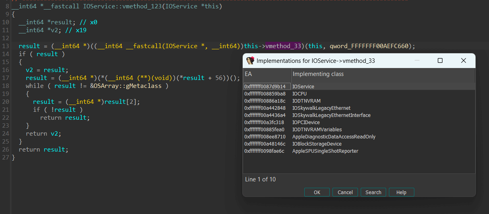
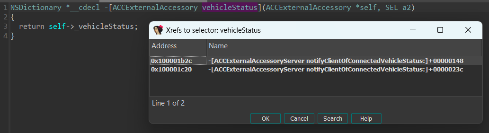

# IDA iOS Helper

A plugin for IDA Pro 9.0+ to help with iOS code analysis.

## Supported features

- KernelCache
    - Calls to `OSBaseClass::safeMetaCast` apply type info on the result.
    - When the keyboard is on a virtual call (`cls->vcall()`), Shift+X will show a dialog with all the possible
      implementations of the virtual method. It requires vtable symbols to be present.
    - When in a C++ method named Class::func, Ctrl+T will change the first argument to `Class* this`. Also works for
      Obj-C instance methods.
    - Name globals from `OSSymbol::fromConst*` calls, locals from `get/setProperty` calls, ...
    - Rename and type all global kalloc_type_view. Use their signature to mark fields as pointers for the actual types.
- Objective-C
    - Hide memory management
      functions - `objc_retain`, `objc_release`, `objc_autorelease`, `objc_retainAutoreleasedReturnValue`.
        - Optimize `_objc_storeStrong` to an assignment.
    - collapse `__os_log_impl` calls.
    - Hide selectors and static classes from Objective-c calls.
    - When in Obj-C method, Ctrl+4 will show xrefs to the selector.
- Common
    - Remove `__break` calls.
    - collapse blocks initializers and detect `__block` variables (use Alt+Shift+S to trigger detection).

## Installation

1. clone the repo.
2. symlink `src` folder into your IDA Pro plugins folder:
    - on unix: `~/.idapro/plugins/`
    - on windows: `%APPDATA%\Hex-Rays\IDA Pro\plugins`. `mklink /d` command can be used to create a symlink.
3. Restart IDA.

## Examples

### Remove `__break`

Before:

```c
    if ( ((v6 ^ (2 * v6)) & 0x4000000000000000LL) != 0 )
      __break(0xC471u);
```

After: removed.

### Hide selectors of Obj-C calls

Before:

```c
   -[NSFileManager removeItemAtPath:error:](
      +[NSFileManager defaultManager](&OBJC_CLASS___NSFileManager, "defaultManager"),
      "removeItemAtPath:error:",
      +[NSString stringWithUTF8String:](&OBJC_CLASS___NSString, "stringWithUTF8String:", *(_QWORD *)&buf[v5]),
      0LL);
```

After:

```c
   -[NSFileManager removeItemAtPath:error:](
      +[NSFileManager defaultManager](),
      +[NSString stringWithUTF8String:](*(_QWORD *)&buf[v5]),
      0LL);
```

### Block initializers

Before:

```c
v10 = 0LL;
v15 = &v10;
v16 = 0x2000000000LL;
v17 = 0;
if ( a1 )
{
  x0_8 = *(NSObject **)(a1 + 16);
  v13.isa = _NSConcreteStackBlock;
  *(_QWORD *)&v13.flags = 0x40000000LL;
  v13.invoke = func_name_block_invoke;
  v13.descriptor = &stru_100211F48;
  v13.lvar3 = a1;
  v13.lvar4 = a2;
  v13.lvar1 = a3;
  v13.lvar2 = &v10;
  dispatch_sync(queue: x0_8, block: &v13);
  v11 = *((_BYTE *)v15 + 24);
}
else
{
  v11 = 0;
}
_Block_object_dispose(&v10, 8);
return v11 & 1;
```

After:

```c
v10 = _byref_block_arg_init(0);
v10.value = 0;
if ( a1 )
{
  v6 = *(NSObject **)(a1 + 16);
  v9 = _stack_block_init(0x40000000, &stru_100211F48, func_name_block_invoke);
  v9.lvar3 = a1;
  v9.lvar4 = a2;
  v9.lvar1 = a3;
  v9.lvar2 = &v10;
  dispatch_sync(queue: v6, block: &v9);
  value = v10.forwarding->value;
}
else
{
  value = 0;
}
return value & 1;
```

### Collapse `os_log`

Before:

```c
  v9 = gLogObjects;
  v10 = gNumLogObjects;
  if ( gLogObjects && gNumLogObjects >= 46 )
  {
    v11 = *(NSObject **)(gLogObjects + 360);
  }
  else
  {
    v11 = (NSObject *)&_os_log_default;
    if ( ((v6 ^ (2 * v6)) & 0x4000000000000000LL) != 0 )
      __break(0xC471u);
    if ( os_log_type_enabled(oslog: (os_log_t)&_os_log_default, type: OS_LOG_TYPE_ERROR) )
    {
      *(_DWORD *)buf = 134218240;
      *(_QWORD *)v54 = v9;
      *(_WORD *)&v54[8] = 1024;
      *(_DWORD *)&v54[10] = v10;
      if ( ((v6 ^ (2 * v6)) & 0x4000000000000000LL) != 0 )
        __break(0xC471u);
      _os_log_error_impl(
        dso: (void *)&_mh_execute_header,
        log: (os_log_t)&_os_log_default,
        type: OS_LOG_TYPE_ERROR,
        format: "Make sure you have called init_logging()!\ngLogObjects: %p, gNumLogObjects: %d",
        buf: buf,
        size: 0x12u);
    }
  }
  if ( ((v6 ^ (2 * v6)) & 0x4000000000000000LL) != 0 )
    __break(0xC471u);
  if ( os_log_type_enabled(oslog: v11, type: OS_LOG_TYPE_INFO) )
  {
    if ( a1 )
      v12 = *(_QWORD *)(a1 + 8);
    else
      v12 = 0LL;
    *(_DWORD *)buf = 138412290;
    *(_QWORD *)v54 = v12;
    if ( ((v6 ^ (2 * v6)) & 0x4000000000000000LL) != 0 )
      __break(0xC471u);
    _os_log_impl(
      dso: (void *)&_mh_execute_header,
      log: v11,
      type: OS_LOG_TYPE_INFO,
      format: "Random log %@",
      buf: buf,
      size: 0xCu);
  }
```

after:

```c
  if ( oslog_info_enabled() )
  {
    if ( a1 )
      v4 = *(_QWORD *)(a1 + 8);
    else
      v4 = 0LL;
    oslog_info("Random log %@", v4);
  }
```

## Automatic casts with `OSBaseClass::safeMetaCast`

Before:

```c++
 OSObject *v5;
 v5 = OSBaseClass::safeMetaCast(a2, &IOThunderboltController::metaClass);
```

After:

```c++
 IOThunderboltController *v5;
 v5 = OSDynamicCast<IOThunderboltController>(a2);
```

## Jump to virtual call

Use `Shift+X` on a virtual call to jump.



## Xrefs to selector

Use `Ctrl+4` inside an Objective-C method to list xrefs to its selector.



## Development

In order to have autocomplete while developing, you need to add IDA's include folder ( `$IDA_INSTALLATION/python/3` ) to
your IDE.

- on Visual Studio code you can add the folder to the analyzer's extra paths in the `settings.json` file:

```json
{
  "python.analysis.extraPaths": [
    "$IDA_INSTALLATION\\python\\3"
  ]
}
```

- on PyCharm you can add the folder to the interpreter's paths in the project settings.
  Alternatively, you can create `idapython.pth` in `$VENV_FOLDER/Lib/site-packages` and add the path to it.

Inside IDA, you can use `ioshelper.reload()` to reload the plugin during development.
If you modify `IS_DEBUG = True` inside `src/objchelper/base/reloadable_plugin.py`, then you can use `F2` to reload the
plugin.